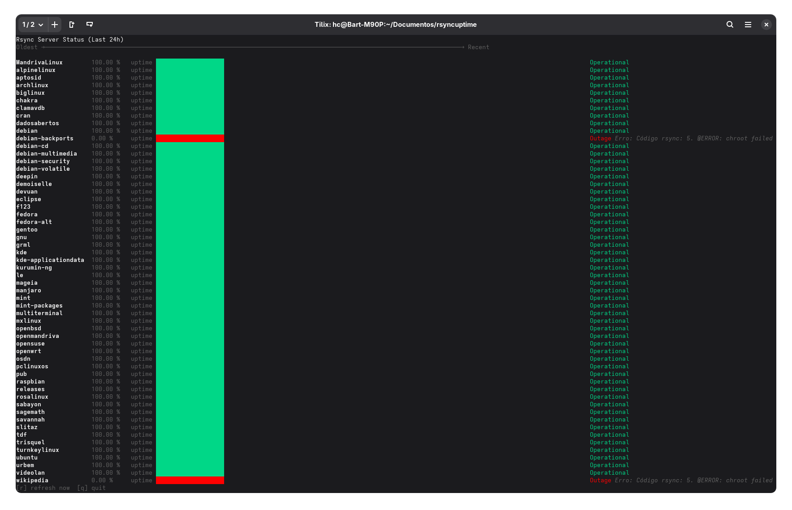

# Rsync Uptime Monitor



Serviço web em Go para monitorar módulos de um servidor `rsync`, com interface TUI para visualização do histórico.

## Funcionalidades

- Descoberta automática dos módulos disponíveis
- Monitoramento periódico (configurável)
- API HTTP para consulta de status e histórico
- Validação de entrada para segurança
- Cliente TUI para visualização no terminal

---

## Como rodar

**Pré-requisitos:**

- [Go](https://go.dev/doc/install) (>= 1.18)
- `rsync` instalado

**Servidor:**

```sh
go run server.go
```

Por padrão, o servidor roda na porta 8080. Para customizar variáveis de ambiente:

```sh
RSYNC_URL="rsync://sagres.c3sl.ufpr.br/" POLLING_INTERVAL_SECONDS=60 PORT=9090 go run server.go
```

**Cliente TUI:**

```sh
go run tui.go
```

No cliente TUI, use `DEBUG=1` para ativar logs detalhados em arquivo (`tui-debug.log`).

---

## Executando como serviço (systemd)

1. Compile o binário:

   ```sh
   go build -o server server.go
   ```

2. Edite o arquivo `rsyncuptime.service` conforme seu ambiente:
   - `WorkingDirectory`: diretório do binário
   - `ExecStart`: caminho do binário
   - Variáveis de ambiente podem ser definidas no próprio arquivo

   Exemplo:

   ```ini
   [Unit]
   Description=Rsync Uptime Monitoring Server
   After=network.target

   [Service]
   Type=simple
   WorkingDirectory=/caminho/do/projeto
   ExecStart=/caminho/do/projeto/server
   Restart=on-failure
   RestartSec=5
   Environment=RSYNC_URL=rsync://sagres.c3sl.ufpr.br/
   Environment=POLLING_INTERVAL_SECONDS=300
   Environment=PORT=8080

   [Install]
   WantedBy=multi-user.target
   ```

3. Instale e ative o serviço:

   ```sh
   sudo cp rsyncuptime.service /etc/systemd/system/rsyncuptime.service
   sudo systemctl daemon-reload
   sudo systemctl enable rsyncuptime
   sudo systemctl start rsyncuptime
   sudo systemctl status rsyncuptime
   ```

---

## Testes

Execute:

```sh
go test -v
```

Os testes cobrem validação, respostas HTTP e cenários de erro do rsync.

---

## Exemplos de uso da API

### GET /

```json
{
  "message": "Monitoring all discovered modwules. See endpoints below.",
  "monitored_modules": {
    "debian": "/status/debian",
    "ubuntu": "/status/ubuntu"
  },
  "path": "/",
  "polling_interval_s": 300,
  "rsync_directories": ["debian", "ubuntu"],
  "success": true
}
```

### GET /status/debian (sucesso)

```json
[
  {
    "code": 0,
    "http_status": 200,
    "is_up": true,
    "message": "Operational",
    "path": "/debian/",
    "success": true,
    "timestamp": "2025-07-29T13:59:01.433848536-03:00"
  }
]
```

### GET /status/nonexistent (erro)

```json
{
  "code": 404,
  "error": "Module 'nonexistent' is not monitored.",
  "path": "/status/nonexistent",
  "success": false
}
```

---

## Endpoints principais

- `GET /` — Lista módulos monitorados e informações gerais
- `GET /status/<modulo>` — Histórico de status do módulo

**Códigos de resposta:**

- 200 OK: módulo operacional
- 400 Bad Request: nome inválido
- 404 Not Found: módulo não existe ou não está sendo monitorado
- 500 Internal Server Error: erro interno do rsync

---

## Detalhes técnicos e segurança

- **Descoberta automática de módulos:** O servidor executa o comando `rsync` no endereço configurado para listar todos os módulos disponíveis e começa a monitorar cada um deles automaticamente.
- **Validação de nomes de módulo:** Apenas nomes contendo letras, números, hífen (`-`), underline (`_`) e ponto (`.`) são aceitos. Exemplo válido: `debian-archive`. Isso evita ataques de path traversal e injeção.
- **Histórico de status:** Para cada módulo, o servidor armazena o histórico dos últimos 24h de verificações. O número de registros depende do intervalo configurado em `POLLING_INTERVAL_SECONDS`.
- **Campos de erro e resposta:**
  - Em caso de erro, a resposta pode conter os campos `error`, `code`, `rsync_exit_code` (código de saída do rsync) e `rsync_output` (primeira linha do erro do rsync).
  - Exemplo:

    ```json
    {
      "code": 10,
      "error": "@ERROR: Unknown module 'foo'",
      "http_status": 404,
      "rsync_exit_code": 10,
      "rsync_output": "@ERROR: Unknown module 'foo'",
      "path": "/foo/",
      "success": false,
      "timestamp": "2025-07-29T14:00:00-03:00"
    }
    ```

- **Variáveis de ambiente:**
  - `RSYNC_URL`: endereço base do servidor rsync (padrão: sagres.c3sl.ufpr.br)
  - `POLLING_INTERVAL_SECONDS`: intervalo entre verificações (padrão: 300)
  - `PORT`: porta do servidor HTTP (padrão: 8080)
- **Segurança:**
  - O servidor valida todos os nomes de módulo recebidos na URL para evitar ataques de path traversal e injeção.

## 🐋 Rodando em um Container (Docker):

***Construir a imagem:***
```sh
docker build -t rsyncuptime .
```

***Rodar o container:***
```sh
docker run -p 8080:8080 rsyncuptime  
```

### A aplicação estará disponível em:
***http://localhost:8080***
